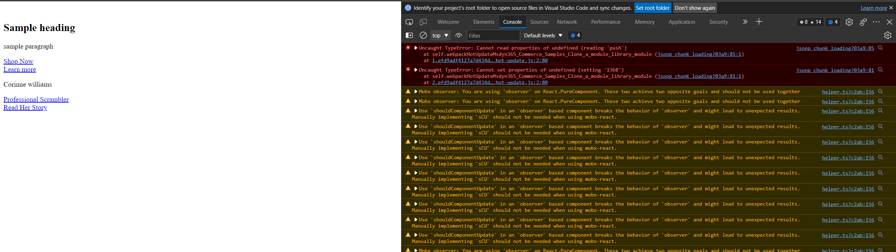

# `Webpack HRM Error: Cannot read properties of undefined (reading 'push') | TypeError: Cannot set properties of undefined (setting '1368')` reproducible repo

This repo can be used to reproduce thge error reported in [webpack/webpack#14873](https://github.com/webpack/webpack/discussions/14873#discussioncomment-2283858) with the correct environment.

## Environment

Note: This environment is my environment where I observed the bug to occur, it isn't to say it's the only or most correct environment to reproduce the bug.

* Windows 10
* Node v16.14.2
* Yarn v1.22.4
* Edge or Chrome
* `webpack` 5.70.0
* `webpack-dev-server` 4.7.4
* `html-webpack-plugin` 5.5.0

## Steps to Reproduce

1. Clone repo
2. Run `yarn`
2. Run `yarn start`
3. Visit <https://localhost:4000/modules?type=super-content-block>
4. Open web developer console and observe everything is looking good
5. Edit `src/modules/super-content-block/super-content-block.view.tsx:37` and replace the string `'Sample comment: foo'` with `'Sample comment: bar 123'` and save
6. Observe the error:

```
Uncaught TypeError: Cannot read properties of undefined (reading 'push')
    at self.webpackHotUpdateMsdyn365_Commerce_Samples_Clone_a_module_library_module (jsonp chunk loading?03a9:85:1)
    at 1.efd9adf4127a7d434d3b.hot-update.js:2:80
```

```
Uncaught TypeError: Cannot set properties of undefined (setting '1368')
    at self.webpackHotUpdateMsdyn365_Commerce_Samples_Clone_a_module_library_module (jsonp chunk loading?03a9:81:1)
    at 2.12875a70a33f616c765c.hot-update.js:2:80
```
7. If you still dont see error, then edit `src/modules/super-content-block/super-content-block.view.tsx:37` and replace the string `'Sample comment: bar 123'` back to `'Sample comment: foo'` and save



**NOTE:** I have seen this error even when appending / prepending / changing pre-existing value of the string, I've observed that the error does'nt always happen. If you don't observe the error, you can stop the server and try again with another `yarn start`. 

**NOTE** I have also attached the webpack config file located at root level of the repo `./webpack-config.js`

## Other Reproducible Actions
* Edit `src/modules/super-content-block/super-content-block.view.tsx:37` and replace the string `'Sample comment: foo'` with `'Sample comment: foo 123'` and save
* Add a simple string variable `const sampleVar = 'Sample variable'` in `src/modules/super-content-block/super-content-block.view.tsx` after line 37 and console.log(sampleVar); it and save


